Module 06: *CONSUMING SHAREPOINT APIS WITH ANDROID*
==========================

##Overview

The lab instructs students in configuring and running an Android app which allows 
the user to edit items in a SharePoint Task list. The lab also has instructions
for adding a new feature to the app.

##Objectives

- Learn how to authenticate with Azure AD from Android using the **Azure Active Directory AuthenticationLibrary (ADAL) for Android**
- Learn how to consume SharePoint APIs from Android using the **Office 365 SDK for Android**
- Implement a new feature in the Android app

##Prerequisites

- [Git version control tool][git-scm]
- [Android Studio][android-studio]
- You must have completed [Module 02][module-two] and have access to both an
  Azure subscription and a test O365 tenant.

[git-scm]: http://git-scm.com
[android-studio]: http://developer.android.com/sdk/index.html
[module-two]: ../02.Setting%20up%20the%20Environments/hands-on-lab.md

##Exercises

The hands-on lab includes the following exercises:

- Set up your workspace and configure and run the Android app
- Implement the missing "delete" feature
- Add a "filter" feature

##Exercise 1: Import and configure the base O365-Tasks
In this exercise you will import the **Tasks for SharePoint O365** Android app into
Android Studio, and configure it for your SharePoint instance.

###Task 1 - Preparation
Prepare the Android SDK by downloading Android API Level 21.

01. Launch Android Studio. From the launch menu, select **Configure > SDK Manager**

    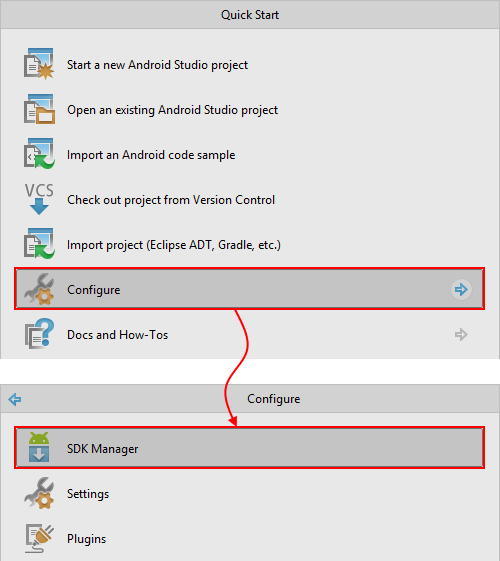

02. Install the following components from **Android 5.0.1 (API 21)**

    - SDK Platform
    - Intel x86 Atom System Image
    - Sources for Android SDK

    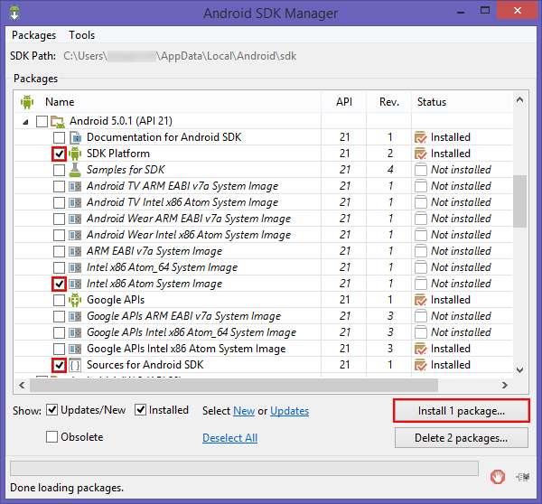

03. Click **Install packages...** and wait for the install to complete.

**Note:** The android SDK install location will be referred to later using "`ANDROID_SDK`".
By default it is installed in your local appdata folder, e.g.:

    C:\Users\<user>\AppData\Local\Android\sdk


###Task 2 - Clone the Git repository

Skip this task if you've already cloned the `DevCampTraining` repository to your local machine.

These instructions assume you have the Git SCM tool installed and available in on
the command line.

01. Open a command prompt.

02. Navigate to the directory where you would like to place the `DevCampTraining` source code.

    ```batch
    C:\> cd C:\My\Dev\Dir
    ```

03. Clone this repository with the following Git command:

    ```batch
    C:\My\Dev\Dir> git clone https://github.com/OfficeDev/DevCampTraining.git
    ```

    Git will clone the repository into a folder named "DevCampTraining"

    ```
    Cloning into 'DevCampTraining'...
    ```

04. Navigate to the Module 06 directory

    ```batch
    C:\My\Dev\Dir> cd "DevCampTraining\06.Hook into SharePoint APIs with Android"
    ```

This directory contains this hands-on lab. All the source code you will need
to continue with the next tasks is in the `/src` directory.

###Task 3 - Import the code into Android Studio

Follow these steps to get the source code ready to build on your machine and 
learn the layout of the code within the Android Studio IDE.

01. From the Launch menu, select **Open an existing Android Studio project**

    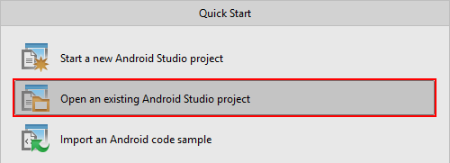

02. Navigate to the `/src` directory and select `o365-tasks`. Click **OK**.
    
    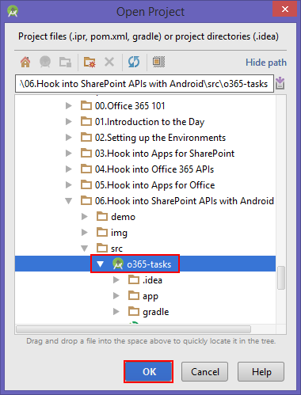

03. Wait for the project to load. You may be prompted with an error message like
    the following:

    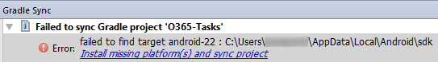

    If so, follow the suggested action by clicking on (e.g.) **Install missing platform(s) and sync content**,
    and wait for the install to finish.

04. The application won't compile yet - it relies on some libraries which have
    not yet been added as dependencies. We'll cover that in the next task.

05. Before continuing, take a moment to expand the **app** node in the
    Project window. Application code is organized under this node.

    **Note:** If the Project window is not visible, open it using the **View > Tool Windows > Project**

    
    
    *  The **manifests** folder contains your Android manifest: `AndroidManifest.xml`

    *  The **java** folder contains application code.
    
    *  The **res** folder contains resources like layouts, images and strings.
       
    Note that the nodes in this folder are virtualized - they do not map
    directly to files and folders on disk. Keep this in mind if you are navigating
    the source tree outside Android Studio!

    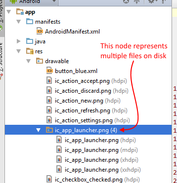

###Task 4 - Add missing dependencies

In this task we will add the missing dependencies to the app.


01. Expand the **Gradle scripts** node. All gradle scripts in the project are
    organized under this node.

02. Open the file **build.gradle (Module: app)**. This file describes all the
    dependencies the project has, and also defines things such as the app ID, app
    version number, min and max SDK versions, build tools version, etc.

    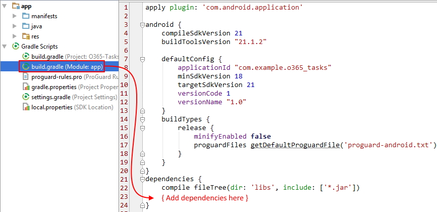

03. Add the following code to the `dependencies` section:

    ```groovy
    //Active Directory Authentication Library - used to authenticate with SharePoint via Azure AD
    compile group: 'com.microsoft.aad', name: 'adal', version: '1.0.5'

    //Sharepoint Services - client classes for consuming Sharepoint's API
    compile group: 'com.microsoft.services', name: 'sharepoint-services', version: '0.12.0', ext:'aar'

    //Dependencies required by sharepoint-services
    //TODO: This dependency should be automatically included by Gradle,
    //TODO: but using the 'aar' version of sharepoint-services seems to interfere with this
    compile group: 'com.google.guava', name: 'guava', version: '18.0'
    ```

    This code describes the app dependencies:

    *  `com.microsoft.aad:adal` - The Active Directory Authentication Library for Android
    *  `com.microsoft.services:sharepoint-services` - The O365 SharePoint SDK for Android
    *  `com.google.guava` - A utility library by Google which is required by the O365 SharePoint SDK

    You can find more information about the O365 SharePoint SDK on the project's [Github page][o365-sdk-android].

04. Android Studio needs to keep it's own project files in sync with our `build.gradle` file. It lets us know
    by showing the following warning message:

    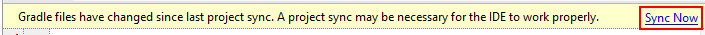

    Click **Sync now** to fix the problem.

    **Note:** You can also force Android Studio to sync with your Gradle files 
    using the command **Tools > Android > Sync project with Gradle files**.

05. You should now be able to successfully build the project.
    To do so, select **Build > Make Module 'app'**.

    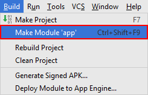

[o365-sdk-android]: https://github.com/OfficeDev/Office-365-SDK-for-Android

###Task 5 - Create and launch the emulator

In this task we will configure and launch the Android emulator, and deploy the app.

01. Launch the Android Device Manager from **Tools > Android > AVD Manager**.

    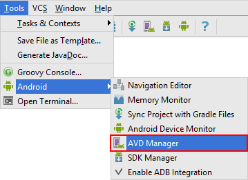

02. Select **Create a virtual device**
    
    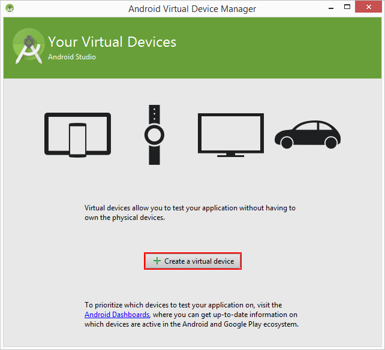

03. Select the **Nexus 5** hardware profile, in the **Phone Category**. Click **Next**.
    
    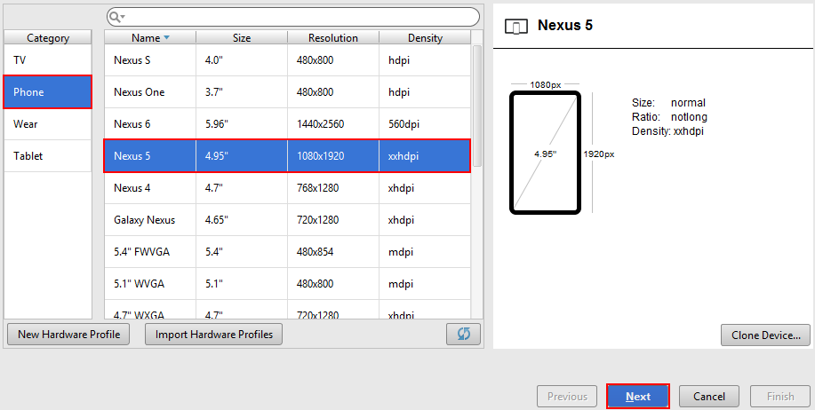

04. Select an "Api Level 21" image, e.g. **Lollipop (API Level 21) x86**. Click **Next**.
    
    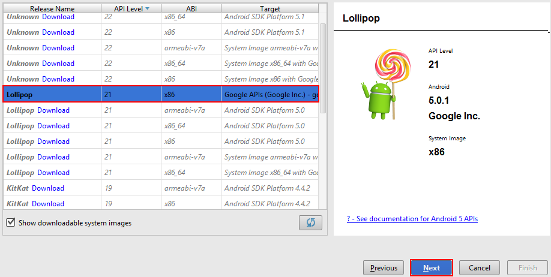

05. Because the Nexus 5 hardware profile is very high resolution (1080x1920), the emulated
    device may not fit on your monitor. 

    We can scale it down though:

    a)  Set "Scale" to **2db on device = 1px on screen**.

    b)  Click **Show Advanced Settings**.

    c)  Scroll down and set "Custom skin definition" to **No Skin**.
    
    This should fit the emulator comfortably on a 1920x1080 monitor. Finally, 
    click **Finish** to create the device.

    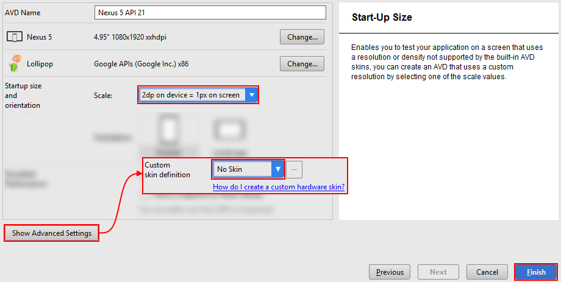

06. When the virtual device has been created, click the **Start** button to start it.

    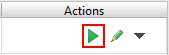

    **Note** please be patient - starting the emulator will take some time.

    

07. Dismiss the AVD manager. From the menu, select **Run > Debug 'app'**.

    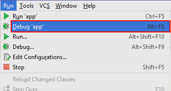

    This will launch the Android Device Chooser.

06. From the device list select the emulator we just started.

    Check the **Use the same device for future launches**. Finally, select **OK**.

    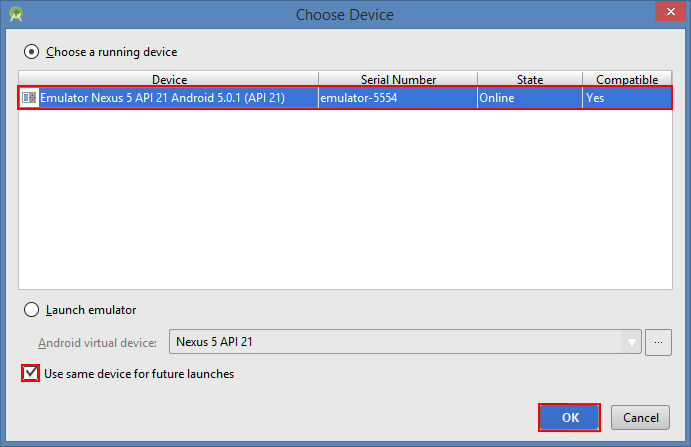

    **Note:** you can leave the emulator running in the background - now whenever you
    **Run** or **Debug** your app it will automatically deploy your code to this emulator.

08. When the android emulator has started the Tasks app should be automatically
    deployed and launched.

    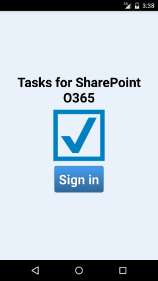

Finally! The application is running. Unfortunately it's not yet properly configured. 
In the next few tasks we'll configure the app to work against your own O365 tenant.


###Task 6 - Add your Azure user account as an admin of your O365 tenant Active Directory

Skip this task if you have already added your Azure user account as an admin of your
O365 tenant Active Directory.

01. Navigate your web browser to the [Azure portal](http://manage.windowsazure.com).

02. From the action bar click **New**.

    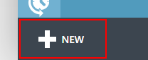

03. Select **Services > Active Directory > Directory > Custom Create**

    

04. Select **Use existing directory**, and then check **I am ready to be signed out now**.
    Click the **Ok** button to continue.

    

05. You will be signed out of the portal and redirected to a sign-in page. 
    Sign in using the credentials for a global administrator in your O365 tenant.

    

06. When authenticated click **continue**. This will add your Azure account as a
    global administrator of the O365 directory.

    

07. Click **Sign out now** and when prompted sign back into your Azure account.

    

You have successfully associated your Azure account with your O365 tenant as a 
global administrator. This gives you the ability to manage the O365 directory 
using the Azure portal.


###Task 7 - Configure the code for your own O365 tenant

In this task we will create an Application in Azure AD to represent our android app.

01. Navigate your web browser to the [Azure portal](http://manage.windowsazure.com).

02. Navigate to the **Active Directory** extension.

    

03. Navigate to the AD instance for your O365 tenant.

    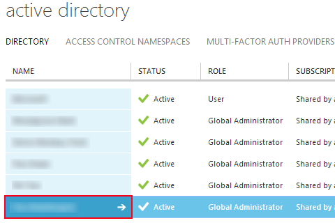

04. Navigate to the **Applications** screen.

    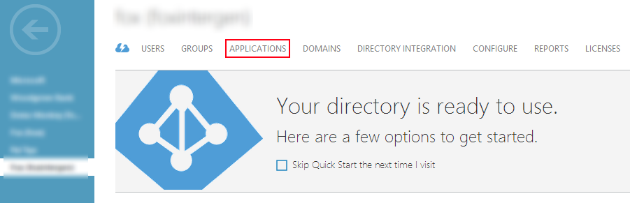

05. From the action bar at the bottom of the page, click **Add**. Then click **Add an application my organization is developing**.

    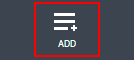

    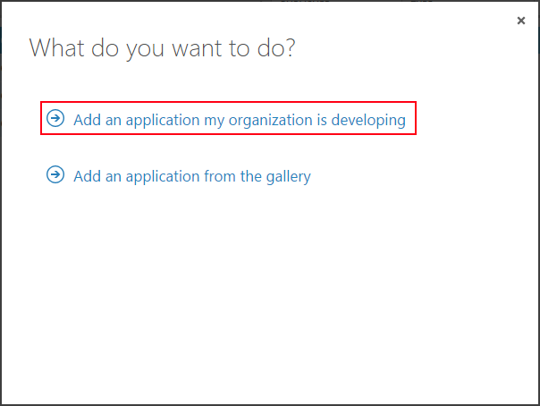

06. For the name field enter "Tasks for O365 SharePoint". For type select "Native client application", then click **Next**.

    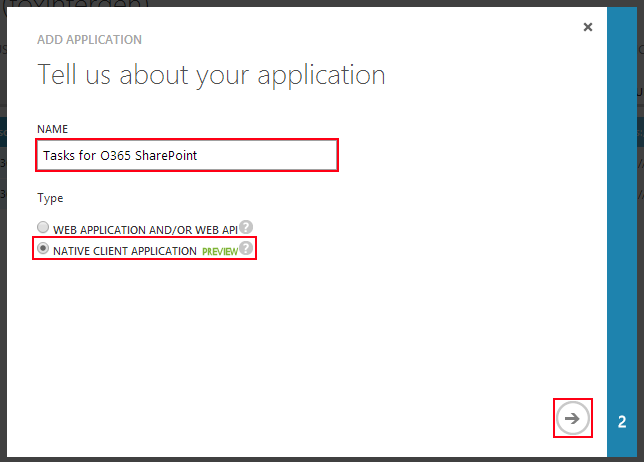

07. For the Redirect Uri field enter "`http://android/complete`", then click **Done**.

    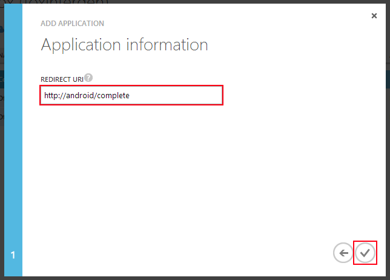

08.  When the app has been created, navigate to the screen for that app. **Note:** this may happen automatically.

    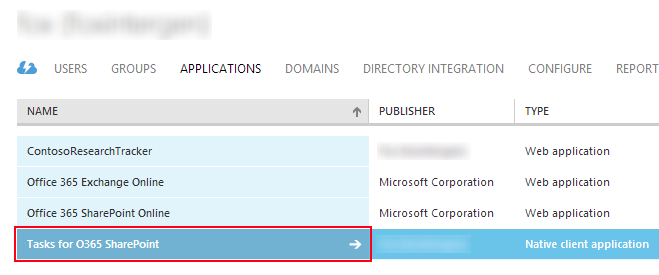

09. Switch to the **Configure** tab

    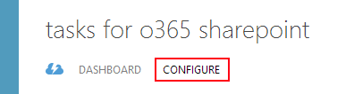

10. Scroll down to the _Properties_ section and copy the **Client Id**. Remember this value for later, as we will use it
    when we are configuring the app in the next step.

    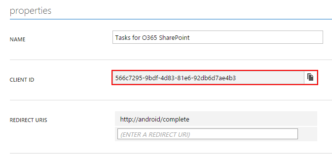

10. Scroll down to the to the _Permissions to other applications_ section and click **Add application**.

    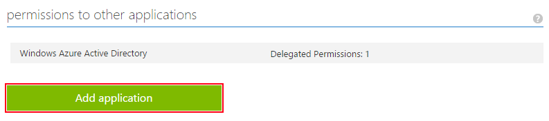

11. From the **Show** drop down, select "Microsoft Apps". From the list below click **Add** on "Office 365 SharePoint Online".
    The application appears in the _Selected_ list on the right-hand side. Click **Done** to continue.

    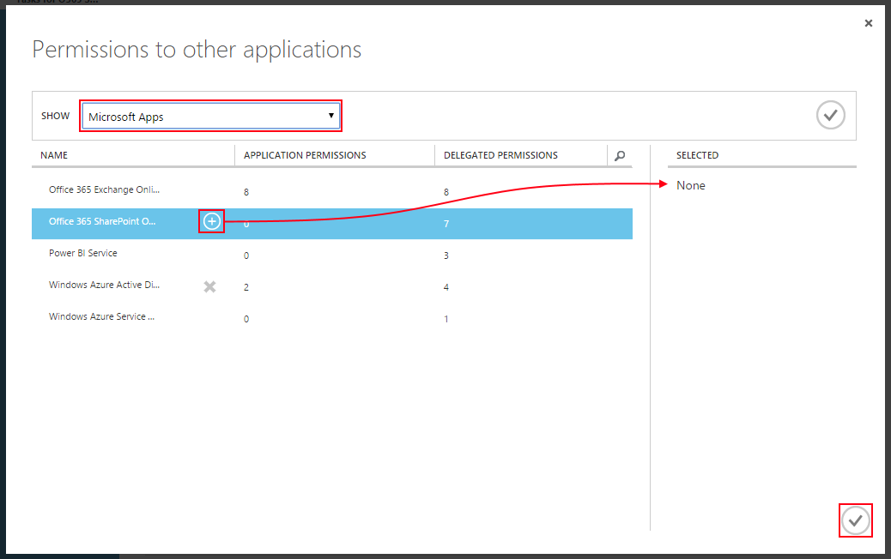

12. Add the following Delegated Permissions for "Office 365 SharePoint Online".

    - _Create or delete items and lists in all site collections_

    

13. Click **Save** to apply the changes.

    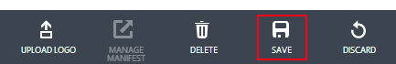


Done! The **Client Id** we created above will be used to configure the Android app in the next task.


###Task 8 - Configure the code for your own O365 tenant

In this task we will configure the app to work agains your own O365 tenant.

01. Return to Android Studio. Locate and open the Java class file `com.microsoft.o365_tasks.Constants`.

    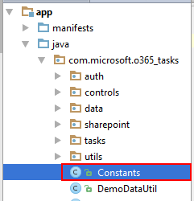

02. Change the constants in this class to suit your own tenancy.

    - Set **`AAD_DOMAIN`** to your O365 tenant domain. E.g. "mycompany.onmicrosoft.com"
    - Set **`AAD_CLIENT_ID`** to the Client Id obtained during Task 4
    - Set **`SHAREPOINT_URL`** to the root url for your O365 SharePoint instance.

    

In this task you provided the configuration values required to authenticate with O365 SharePoint via
Azure Active directory.

The library we are using to authenticate with AD is called the Active Directory Authentication Library (ADAL).
Our code which calls into this library can be found in the `AuthManager` class, and looks something like this:

```java
mAuthContext = new AuthenticationContext(context, Constants.AAD_AUTHORITY, false);

//Asks the user to authenticate directly only if the ADAL cannot locate a refresh token
mAuthContext.acquireToken(currentActivity,
    /* Resource         */ Constants.SHAREPOINT_URL,
    /* Client Id        */ Constants.AAD_CLIENT_ID,
    /* Redirect Uri     */ Constants.AAD_REDIRECT_URL,
    /* Login Hint       */ Constants.AAD_LOGIN_HINT,
    /* Prompt Behaviour */ PromptBehavior.Always,
    /* Extra            */ null,
    new AuthenticationCallback<AuthenticationResult>() {
        public void onSuccess(AuthenticationResult authResult) {
            
            String accessToken = authResult.getAccessToken();

            //continue with application code...
        }

        public void onError(Exception ex) {
             
             //report error to the user...
        }
    }
);
```

The "access token" can now be used when communicating with O365 SharePoint.


###Task 9 - Launch the application

We're ready to launch the app now.

01. Once again, use **Run > Debug 'app'** to deploy the app to the emulator.

02. When the application launches, click **Sign in**.

    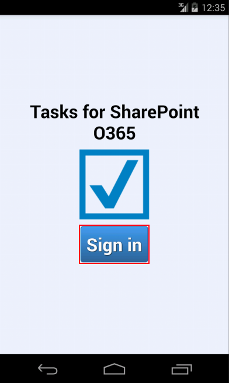

03. You will be prompted to enter your sign-in credentials. Enter them and click **Sign in**.

    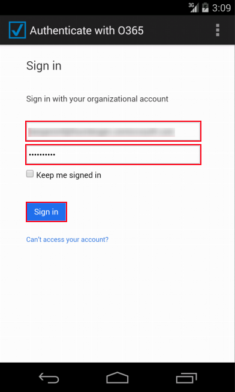

04. If you authenticate successfully the app will automatically create a new Tasks list in SharePoint, and
    populate it with some example data.

    


That's it! You've successfully configured and deployed the "Tasks for O365 SharePoint" app. Try creating and updating
some of the tasks in this list.

Using the **Clear auth token** function from the menu on this screen will clear your current Access Token. Your next request
to the server (e.g. when you refresh the list or create a new task) will trigger a dialog asking you to re-authenticate.


##Exercise 2: Implement the "delete" feature for the app

In this exercise we will implement the "Delete" action for this activity.

###Task 1 - Implement the unimplemented data method

01. Return to Android Studio.

02. Navigate to the `com.microsoft.o365_tasks.data.TaskListItemDataSource` class. This class contains
    all the code in the project which communicates with the SharePoint API.

    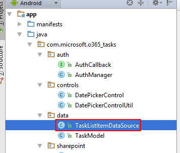

03. Scroll down to the `deleteTask(TaskModel model)` method, at the bottom of the file.
    It is currently unimplemented.

04. Delete the `throw` statement and insert the following code:

    ```java
    AuthManager authManager = mApplication.getAuthManager();

    String accessToken = authManager.getAccessToken();

    OAuthCredentials credentials = new OAuthCredentials(accessToken);

    ListClient client = new ListClient(Constants.SHAREPOINT_URL, Constants.SHAREPOINT_SITE_PATH, credentials);
    ```

    These instructions, in order:

    1.  Get the current Access Token, previously acquired using the ADAL (covered [earlier](#adal_explanation)).
    2.  Create an `OAuthCredentials` instance.
    3.  Construct a new `ListClient`, passing in the configuration variables you set earlier.

05. Next, add the following code:

    ```java
    SPListItem listItem = model.getListItem();

    ListenableFuture<Void> result = client.deleteListItem(listItem, Constants.SHAREPOINT_LIST_NAME);

    result.get();
    ```

    These instructions, in order:

    1.  Get an instance of `SPListItem` to delete. In this case, the `TaskModel` class contains the object
        we need. Alternatively, we could query SharePoint for a list item using the `ListClient`.
    2.  Make a call to SharePoint using the `deleteListItem` function. This returns a "future", which represents
        the eventual completion of the operation.
    3.  Wait for the result synchronously by calling `result.get()`.

    **Note** the `get()` call blocks the thread! You can also wait on this result asynchronously using
    the `Futures.addCallback` function, e.g.

    ```java
    Futures.addCallback(result, new FutureCallback<Void>() {
        public void onSuccess(Void result) {
            //Handle success
        }

        public void onFailure(Throwable t) {
            //Handle failure
        }
    });
    ```

06. **Note:** before continuing make sure that there are not errors in the file.
    Errors will be marked with a red squiggle automatically:

    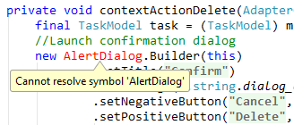

    If you find any errors place the caret on them and press **Alt + Enter** to see if 
    Android Studio offers to fix them automatically.

    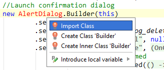

    Here I've used the **Import class** function to add the missing `import` statement to
    the top of the file.

###Task 2 - Test the new Delete feature

In this task we will test the "Delete" feature we just added. The `deleteTask` function is currently
called from one place - the "Delete" context menu item in the List Tasks activity.

01. Start debugging the **o365-tasks** app with **Run > Debug 'app'**. When the app launches, sign in.

02. Long-press on any task in the list - a context menu will appear. Select **Delete**.

    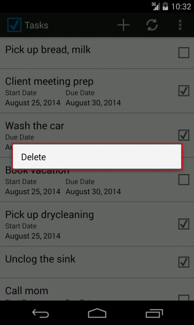

03. Tap **Delete** to confirm.

    

04. The item will be deleted and the view will refresh.

Done! You've successfully implemented the missing Delete feature.

In review, you've learnt how to:

*  Construct

##Exercise 3: Add a "filter" feature to the app
In this exercise we will add a "Filter" option to the List Tasks activity.

###Task 1 - Write the new filter feature

01. Return to Android Studio.

02. First we will update the List Tasks activity options menu.
    Navigate to the "`list_tasks_options.xml`" menu template.

    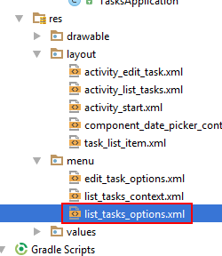


04. Add the following XML:

    ```xml
    <item
        android:id="@+id/action_filter_completed"
        android:orderInCategory="800"
        android:showAsAction="never"
        android:checkable="true"
        android:title="@string/action_filter_completed" />
    ```

07. Navigate back to the java class `com.microsoft.o365_tasks.ListTasksActivity`. 
    Add the following import statements to the top of the file:
        
    ```java
    import com.microsoft.sharepointservices.Query;
    import android.content.SharedPreferences;
    ```

09. At the bottom of the `ListTasksActivity` class add the following block:
    
    ```java
    private static class PreferencesWrapper {
        private static final String PREFS_FILTER_COMPLETED = "filter_completed";
        private SharedPreferences mPreferences;
        public PreferencesWrapper(SharedPreferences preferences) {
            mPreferences = preferences;
        }
        public boolean getFilterCompleted() {
            return mPreferences.getBoolean(PREFS_FILTER_COMPLETED, false);
        }
        public void setFilterCompleted(boolean completed) {
            mPreferences.edit()
                        .putBoolean(PREFS_FILTER_COMPLETED, completed)
                        .apply();
        }
    }
    ```

    This internal static class wraps the android `SharedPreferences` utility to give us 
    a nice strongly-typed interface to it.

    **Note:** this block must be pasted **inside** the final brace in the file - Java does not support multiple
    seperate class definitions per file.

10. At the top of the class add the following member variable:

    ```java
    private PreferencesWrapper mPreferences;
    ```

12. Next, initialize the variable in the "`onCreate`" function:

    ```java
    mPreferences = new PreferencesWrapper(mApplication.getSharedPreferences("listtasks_prefs", Context.MODE_PRIVATE));
    ```

13. In the "`onCreateOptionsMenu`" function we must retrieve and initialize the `action_filter_completed` checkbox we
    defined earlier. Add the following line before the final return statement.

    ```java
    menu.findItem(R.id.action_filter_completed).setChecked(mPreferences.getFilterCompleted());
    ```

14. In the "`onOptionsItemSelected`" function we must add code to handle taps on the new menu option. Add the following
    switch case:

    ```java
    case R.id.action_filter_completed:
        optionsActionFilterCompleted(item);
        return true;
    ```

15. Next add the "`optionsActionFilterCompleted`" function which will handle updating the `action_filter_completed` menu
    item and refreshing the screen.

    ```java
    private void optionsActionFilterCompleted(MenuItem item) {   
        boolean flag = !item.isChecked();
        item.setChecked(flag);
        mPreferences.setFilterCompleted(flag);
        //refresh
        optionsActionRefresh();
    }
    ```

16. Finally, navigate to the "`refresh`" function and add the following code to the "`doInBackground`" inner function:

    ```java
    Query query = new Query();
    if (mPreferences.getFilterCompleted()) {
        query.field("PercentComplete").lt(TaskModel.COMPLETED_MAX);
    }
    ```
       
    This creates and configures new `Query` object. The Query class is used to programatically
    build OData query strings. It can be used to create fairly complicated queries!

    This query is simple: Filter to items where the "PercentComplete" field is less than `COMPLETED_MAX` - 
    i.e. return only tasks which are less than 100% complete.

    The resulting query string would be something like: `$filter=PercentComplete lt 100`.

    Try exploring the Query class to see what other operations you can perform.

17. Finally, change the `getTasksByQuery` function call to pass the new `query` variable in argument.

    ```java
    return new TaskListItemDataSource(mApplication).getTasksByQuery(query);
    ```

    Android Studio should report an error - `getTasksByQuery` does not accept any arguments!
    We're going to change that next.

18. Return to the `com.microsoft.o365_tasks.data.TaskListItemDataSource` class and locate the 
    `getTasksByQuery` function.


19. Change the function signature to add the `Query` argument:

    ```java
    public List<TaskModel> getTasksByQuery(Query query) throws Exception
    ```

20. Delete the statement `Query query = new Query();` and replace it with this:

    ```java
    if (query == null) {
        query = new Query();
    }
    ```


Done! These changes add a filter on the `PercentComplete` field to the OData query sent to SharePoint when the
"Filter completed tasks" option is checked. This filters out any tasks which have been marked as 100% complete.

Note that this setting is automatically persisted thanks to our use of the Android `SharedPreferences` class.


###Task 2 - Test the new Filter function

In this task we will test the "Filter" function we just implemented.

01. Start debugging the **o365-tasks** app with **Run > Debug 'app'**. When the app launches, sign in.

02. When the List Tasks activity has loaded, tap the **Options menu** button in the top-right.
    Next, tap **Filter completed tasks** to confirm.

    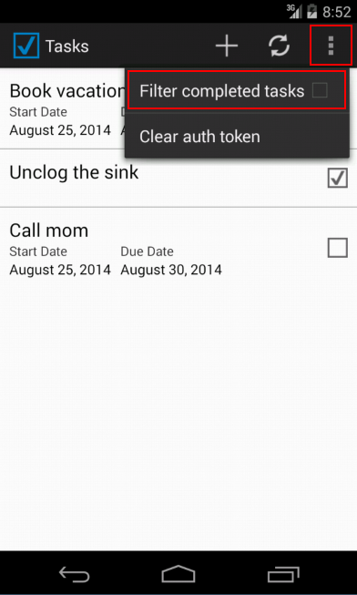

04. The view will refresh, and all "completed" tasks will be filtered out. Repeating the operation will disable
    the filtering.


##Summary

By completing this hands-on lab you have learnt:

01. Some of the basics of Android development.

02. How to use the 0365 SharePoint Lists API for Android 

03. How to filter queries with the 0365 SharePoint Lists API for Android 

